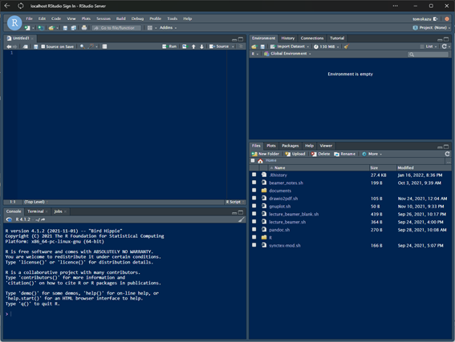

# RとRStudioのインストール

## Rが使えるパソコン

Rはオープン・ソースで開発されており，Windows，Mac，Linuxのいずれでも利用可能。Rそのものは性能の低いマシンでも十分に動作する(ただし，分析するデータの規模や用いる分析手法によってはある程度高性能なパソコンが必要になるかもしれない)。また，RStudioは統合開発環境(Rのコードを編集したり実行したりできるだけでなく，プロジェクトの管理などもできる)。Rを使う上で必須と言えるソフトウェア。デスクトップアプリケーションと，Webブラウザをインターフェイスとして利用するRStudio Serverの2種類がある。どちらも基本的には無料で使える。

Rを使うのであれば，個人的にはRStudio ServerがセットアップされたDockerイメージを用いるのがおすすめ。セットアップのコストが最小限ですむ上に，OSに関係なく使うことができる。複数のパソコン(OSが違っていてもOk)を使う場合にも，簡単に同じ環境を構築できる。

Dockerを利用しないのであれば，OSはMacかLinuxがおすすめ。Windowsは，少しパソコンに詳しいのであれば問題ないと思うが，MacやLinuxにくらべてWindowsならではのトラブルが多い。ただし，WindowsにはWSL(Windows Subsystem for Linux)という仮想環境が用意されており，その上でLinuxを動かすことができる。WindowsでRを使うのであれば，WSL上のLinuxにRやRStudio Sercerをインストールして使うのがおすすめ。

まとめると，おすすめ順に

1.  DockerでRStudio Serverを使う(どのOSでも同じ環境を構築可能)
2.  Mac(もしくはLinux)にインストールして使う
3.  WindowsのWSL上にRStudio Serverをインストールして使う
4.  Windowsにインストールして使う

## インストール方法

インストールの方法については[高知工科大学の矢内先生のホームページ](https://yukiyanai.github.io/jp/resources/)に，これ以上丁寧に説明することはできないというくらいに丁寧な解説スライドが公開されている。Ubuntu，Mac，Windows版があるので，これらを参考にインストールすると良い。ただし，うまくいかなくても矢内先生に直接質問のメールを送ったりはしないこと。以下は，補足。

### MacにHomebrewを使ってインストールする

Homebrewを使うとRとRStudioをまとめて簡単にインストールできる。

-   HomebrewはMacのパッケージマネージャ。ソフトのインストールやアップグレードの管理が容易にできるようになる。

    -   RとRStudioもHomebrewを使えば簡単にインストールできる。
    -   Homebrewをインストールしていない人は，ターミナルで以下のコマンドを実行すればインストール可能(詳細は，[ここ](https://brew.sh/ja/)を参照)。

    ```{bash eval=F}
    /bin/bash -c "$(curl -fsSL https://raw.githubusercontent.com/Homebrew/install/HEAD/install.sh)"
    ```

-   Homebrewがインストールできたら，ターミナルで以下のコマンドを実行することでRとRStudio，ついでにXquartzをインストールできる。

    ```{bash eval=F}
    brew install --cask r rstudio xquartz
    ```

### Dockerイメージを使う

Dockerを使うと，RStudio Serverがセットアップされたコンテナを簡単に使うことができる。Docker Desktopをインストールしておけば，以下のコマンドだけでRStudio Serverが起動する。

``` bash
docker run --rm -ti -e PASSWORD=yourpassword -p 8787:8787 rocker/rstudio
```

コマンドを実行したら，ブラウザで`localhost:8787`にアクセスすればRStudio Serverにアクセスできる。ユーザー名は`rstudio`，パスワードは`yourpassword`。ただし，これはあくまでお試し用。実際に使うにはもう少し設定が必要。

LatexなどもまとめてDockerコンテナ化したものを作ったので，[こちら](https://github.com/tomokazu518/research_env)を参考にしてほしい。

### WSLにインストールして使う

いまではDockerを使うのが一般的なので，あまりおすすめしないが，以前に書いた解説があるので一応リンクだけ張っておく。

- [WSL導入メモ](https://tomokazu518.github.io/public/PC/wsl/)
- [WSLでRStudio Server](https://tomokazu518.github.io/public/PC/rstudio-server/)

## RStudioの画面

RStudioを起動すると，細かい違いはあれ下のような画面が表示されるはず。



デフォルトでは白背景の配色になっていると思うが，コードを書くときは黒や青背景の方が見やすいので変更している。見た目を変更するには，RStudioのメニューから[Tools]\>[Global Options...]を選び，Appearanceで設定する。長時間の作業を行う場合には，色やフォントによって作業効率や目の疲れ方がけっこう変わってくるので，いろいろ試して自分にあった設定にしよう。

RStudioの画面は，デフォルトで4ペイン(4分割)。最初はそのまま使っても良いと思うが，画面のレイアウトは比較的自由に変えることができるので，慣れてきたら自分が使いやすいように設定しよう。

各ペインにはタブが複数配置されている。まずは，よく使うものだけ説明する。

-   Sourceペイン：デフォルトでは左上。何もファイルが開かれていない状態では最小化されているので，画面左上の+マークで新しいスクリプト・ファイル(R Script)を作成してみよう。
-   Consoleペイン：デフォルトでは左下。Rにコマンドを入力して実行する画面。
-   Environmentなどのペイン：デフォルトでは右上。Environmentタブには記憶されている変数やデータなどが表示される。Historyタブには実行したコマンドの履歴が表示され，選択して再度実行できる。
-   Filesなどのペイン：デフォルトでは右下。Filesタブには現在のディレクトリにあるファイルのリストが表示される。ファイル名をクリックすればファイルを開くことができる。RのソースコードなどやデータフレームはSourceペインで開かれる。Plotsタブはグラフが表示される場所。

Rで単発のコマンドを実行するときには，Consoleタブで行う。ただし，通常はスクリプト・ファイルにコマンドを書いて一つずつ実行していったり，いくつかのコマンドをまとめて実行したりすることが多い。Consoleでコマンドを実行した場合にも，Histroyタブからスクリプト・ファイルへと実行したコマンドを貼り付けておくと良い。そうすれば，いつでも作業を最初から再現できる。研究では，結果を再現できることが極めて重要。再現性を担保できることは，ExcelではなくRを使うメリットの一つ。

スクリプト・ファイルに書かれたコマンドを実行する場合，Ctrlを押しながらEnterを押す。範囲が選択されていない場合には，カーソルのある行(コマンドが複数行にまたがっていてもOk)が実行される。範囲を選択してCtrl+Enterを押せば，選択された範囲のコードが順に実行される。

## ヘルプの参照

Rのコマンド・ヘルプは?のあとにコマンド名を入力すれば参照できる。ヘルプは，Helpタブ(デフォルトでは右下のペイン)に表示される。知らないコマンドが出てきたらまずはヘルプを読む。英語が苦手でもDeepLで翻訳すればだいたい読める。

たとえば，table関数のヘルプを読みたければ，

``` r
?table
```

## チュートリアルの実行

右上のペインにTutorialというタブがあり，そこからRのチュートリアル・レッスンを受けられる。チュートリアルを実行するためのパッケージをインストールするのに時間がかかるが，とりあえず一通り実行してみると，Rの使い方についてのイメージを持つことができるかもしれない。

## パッケージのインストール

Rは本体にパッケージを追加することで，機能を拡張することができる。パッケージをインストールするには，install.packages関数を用いる。とくに，tidyverseパッケージは必ず利用することになるので，インストールしておこう。

```{r eval=F}
install.packages("tidyverse")
```

MacやUbuntuの場合，もしかしたら"openssl"がないみたいなエラーが出るかもしれない。そのときは，opensslをインストールしてから，再度実行する。

opensslはMac(Homebrew)だと，

```{bash eval=F}
brew install openssl
```

Ubuntuだと，

```{bash eval=F}
sudo apt install openssl
```

でインストールできる。

インストールしたパッケージは毎回読み込む必要がある。パッケージを読み込むにはlibrary関数を使う。

```{r eval=F}
library(tidyverse)
```
